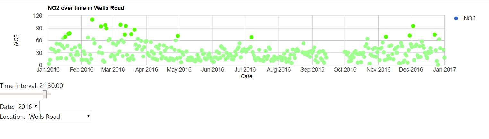
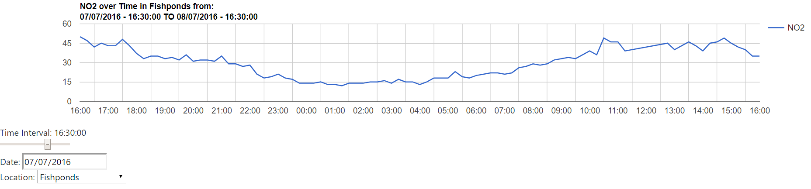
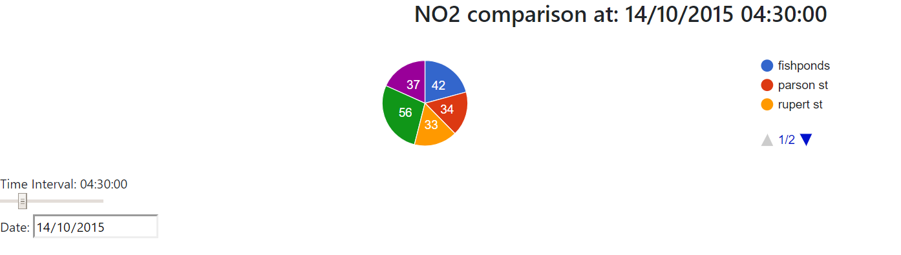
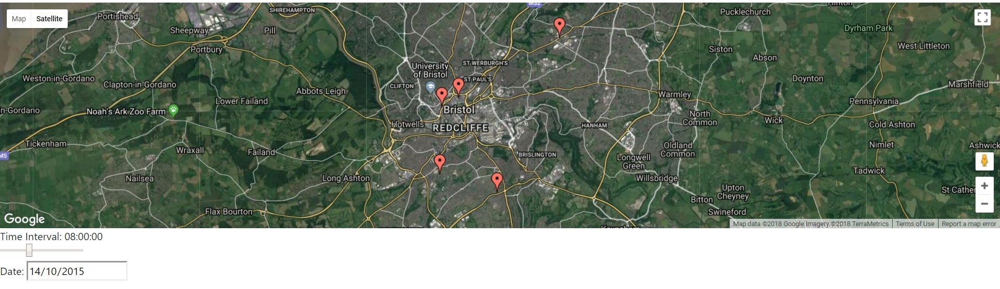

# UWE-UFCFR5-15-3 Assignment
PHP and Google charts integration with a Bristol Air Quality dataset.

Code can be found from [my Github Repository](https://github.com/Prithpal-Sooriya/UWE-UFCFR5-15-3-Assignment)
- The data files can be found in the repository's [WebDevAssignment/files](https://github.com/Prithpal-Sooriya/UWE-UFCFR5-15-3-Assignment/tree/master/WebDevAssignment/files) directory.
- The XML generation from the CSV file can be found [here](https://github.com/Prithpal-Sooriya/UWE-UFCFR5-15-3-Assignment/blob/master/WebDevAssignment/scripts/ExtractCSVAll.php)
- The NO2 XML generation from the XML files can be found [here](https://github.com/Prithpal-Sooriya/UWE-UFCFR5-15-3-Assignment/blob/master/WebDevAssignment/scripts/ConvertXMLtoNO2.php)
- The Charts can be found [here](http://www.cems.uwe.ac.uk/~ps2-sooriya/UWE-UFCFR5-15-3-Assignment/WebDevAssignment/sites/)
-----------
# XML processing models
XML can be processed with different techniques. 2 examples of this are the Stream API for XML(SAX) parsers and Document Object Model (DOM) parsers. In context to php, stream parsers can be seen as `XMLReader` and `XMLWriter` classes.

## What are Stream parsers
Stream parsers are, as the name suggests streams. Streams are way of processing (large) data, one line/byte at a time/sequentially. Programs can abstact away streams, thus can utilitilise the continuous flow of data without having an understanding of where the data had came from. [[stack overflow](https://stackoverflow.com/a/1216400)]

There are 2 different types of parsers: push and pull parsers.
The [php documentation](http://php.net/manual/en/class.xmlreader.php) notes that `XMLReader` is an extension of XML pull parser - whereby a pull parser allows an application interact with the parser to retrieve data from it [[oracle](https://docs.oracle.com/cd/E19316-01/819-3669/bnbdy/index.html)].
Push parsers, on the otherhand, sends (XML) information to the client whether the client is ready or not.

## What are DOM oriented parsers
DOM oriented parsers are an example of tree based parsers. DOM parsers will create objects (of a tree based structure) and store it inside memory. Once the tree is inside memory, DOM objects (e.g. nodes in the tree) can be easily searched [[Oracle](https://docs.oracle.com/cd/E17802_01/webservices/webservices/docs/1.6/tutorial/doc/SJSXP2.html)] - accessing with give a time complexity of best case (binary tree) `O(log(n))` and on worst case `O(n)` [[github](https://github.com/tim-hr/stuff/wiki/Time-complexity:-Binary-search-trees)].

## Why use Stream parsers
Although access times of DOM parsers are fast, they take up a considerable amount of memory compared to streams due to the requirement of storing the whole DOM tree in memory. In cases where an XML dom is too large, it can be infeasable to store the tree in memory.
Stream parsers, on the otherhand, will use little to no memory, as they are reading (pulling) and writing (pushing) data sequentially without storing in memory.

Also in cases there is an uneven and/or large DOM inside memory, accessing parts of the DOM will take `O(n)` amount of time (where `n` would be the size of the uneven DOM). In cases such as this, stream parsers will perform much more quickly compared to DOM parsers. A good example using stream parser than DOM parser is in our project, where `.xml` files were fully read and converted to `no2.xml` files.

## issues with Stream parsers
Depending on the document to process, stream (pull) parsers may take multiple passes through data to create wanted output. This can be avoided by careful planning and design of when to use DOM or stream parsers. In some cases DOM parsers can be used alongside stream parsers, where smaller DOM's are created from the parents of leaf nodes. This was done in this projects code when creating the `no2.XML` files:
``` PHP
<?php
  //the XMLReader (stream) is expanded and creates a DOM structure.
  $xmlElement = simplexml_import_dom($domDoc->importNode($reader->expand(), true));
?>
```

Stream parsers can also be harder to read compared to DOM style parsers. For developers using stream parsers, it is important to document the use of the parsers to allow other developers to understand the purpose of the code easier. The reason for using DOM created by the stream parser was that it was much more easier to work with compared to pure stream parsers only.

---------------------

# Visualisation Extension

## Scatter Chart
- The scatter chart has included colouring for each individual point (based on the colour encodings from the [DEFRA](https://uk-air.defra.gov.uk/air-pollution/daqi) site).
- Noted that some points from the dataset are negative (bad) values, I have chose to leave them in and give a "blue" colour to them. This was because (after advice from our Tutor Prakash) no information was given to either disclude these results or to use the `abs` function on them (to make the result absolute).
- Added user input of:
  - Year (e.g. 2015) via html select/dropdown;
  - Location (e.g. Fishponds) via html select/dropdown;
  - And time (e.g. 10:00:00) via html input range/slider;



## Line Chart
- Added a customised tooltip, which also included colour encodings from the [DEFRA](https://uk-air.defra.gov.uk/air-pollution/daqi) site for the corresponding NO2 values.
- Added user input for:
  - Date (e.g. 12/06/2016 in the DD/MM/YYYY format) using HTML date;
  - Location (e.g. Fishponds) via HTML select/dropdown;
  - Time Interval (e.g. 08:00:00) va HTML range/slider.
- Used majority ES6 Javascript Coding style (to utilise some benefits of modern Javascript).
- This example used asynchronous Promises (by using the ES6 `fetch` command in JavaScript).
  - By utilising asynchronous calls, I could chain multiple calls to the php server (thus allowing for a smooth transition of chart updates when using the slider).
  - Although this was a new paradigm I was using, I did face some issues, that are still somewhat visible. The main example is by continuously moving the time interval slider for a prolonged period of time, it would cause a massive chain of Promises to complete - thus causing some "lag" till the chart is updated with the latest value.
    - A solution to this was to store all the `Promise`'s in an array (via `array.push() function`), then call the `Promise.all()` function to call only the latest promise. This Limited the number of promises to execute, and also only update the graph with the latest promise.
    - I did also try adding a timeout to the fetch promise, however that did not solve the problem (and ended up stopping new fetch requests).



## Pi Chart
- Added a pi chart that displays the percentage and quantity of NO2 in different locations
- User selection provided for the date (DD/MM/YYYY) and time (HH:MM:SS).
- JQuery Ajax asynchronous calls for this (to show a different method of calling the php server).
```Javascript
let json = $.ajax({
  url: url,
  dataType: "json",
  data: {
    time: time,
    date: datestr
  },
  type: "POST",
  success: (data) => drawChart(data, time, datestr)
//    async: false
}).responseText;
```
  - JQuery async Ajax was quite easy to work with compared to Promises, however lacks flexability compared to Promises (with customised commands to do next with the `.then` command, and also easy catching of errors with `.catch` command)



## Maps
- Added a map that shows the different locations and clicking on them will show the values of them.
- Allows user input for Date (DD/MM/YYYY) and Time (HH:MM:SS).
- This did require an API key for Google Maps API (as Google Charts has a dependency to Google Maps API).



---------------------

# References

Anon (no date) _terminology - What is a stream? - Stack Overflow_. Available from: https://stackoverflow.com/questions/1216380/what-is-a-stream/1216400#1216400 [Accessed 21 March 2018].

Anon (no date) _The XMLReader Class_. Available from: http://php.net/manual/en/class.xmlreader.php [Accessed 21 March 2018].

Anon (no date) _XMLWriter_. Available from: http://php.net/manual/en/book.xmlwriter.php [Accessed 21 March 2018].

Anon (no date) _Pull Parsing versus Push Parsing_ Avaiable from: https://docs.oracle.com/cd/E19316-01/819-3669/bnbdy/index.html [Accessed 21 March 2018].

Anon (no date) _Why StAX?_ Available from: https://docs.oracle.com/cd/E17802_01/webservices/webservices/docs/1.6/tutorial/doc/SJSXP2.html [Accessed 21 March 2018].

Anon (no date) _Time complexity: Binary search trees_ Available from: https://github.com/tim-hr/stuff/wiki/Time-complexity:-Binary-search-trees [Accessed 21 March 2018].
